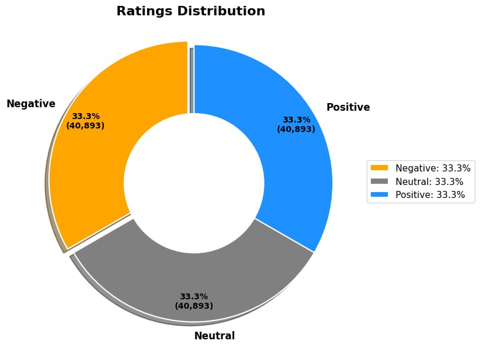
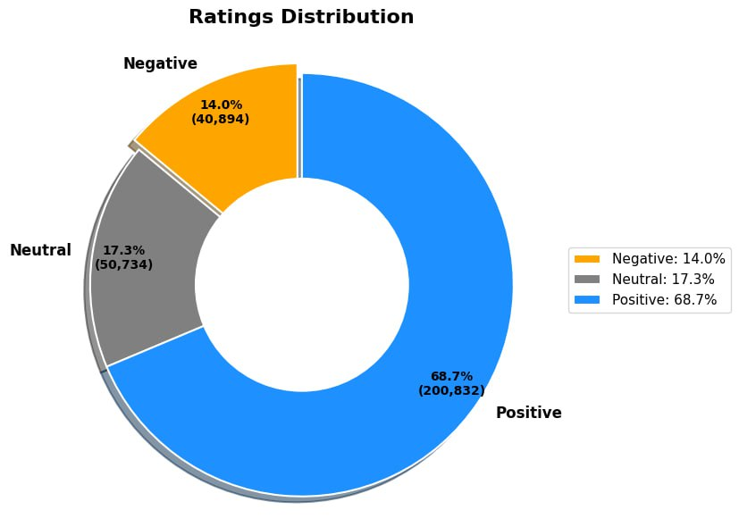

# LSAHR Dataset

**LSAHR** — *Large-Scale Arabic Hotel Reviews* — is a large-scale Arabic hotel review dataset collected from **Booking.com**.

It contains approximately **292,462 Arabic hotel reviews**, including hotel ratings, user metadata, hotel information, review content, and sentiment polarity scores.

The dataset is designed for research and development in:

* Arabic Sentiment Analysis
* Natural Language Processing — NLP
* Recommendation Systems
* Hotel Review Mining
* Arabic Text Classification

---

## Dataset Versions

The dataset is provided in two versions: **balanced** and **unbalanced**.

| Version            | Number of Reviews | File Size | Format |
| ------------------ | ----------------: | --------: | ------ |
| Balanced Dataset   |   122,679 reviews | ~28.80 MB | XLSX   |
| Unbalanced Dataset |   292,462 reviews |    ~40 MB | XLSX   |

---

## Ratings Distribution

The following figures show the distribution of review polarities in both dataset versions.

### Balanced Dataset Distribution

The balanced dataset contains an equal distribution of reviews across the three sentiment classes: **Negative**, **Neutral**, and **Positive**.



| Sentiment Class | Number of Reviews | Percentage |
| --------------- | ----------------: | ---------: |
| Negative        |            40,893 |      33.3% |
| Neutral         |            40,893 |      33.3% |
| Positive        |            40,893 |      33.3% |

---

### Unbalanced Dataset Distribution

The unbalanced dataset reflects the original distribution of reviews, where **Positive** reviews represent the majority of the dataset.



| Sentiment Class | Number of Reviews | Percentage |
| --------------- | ----------------: | ---------: |
| Negative        |            40,894 |      14.0% |
| Neutral         |            50,734 |      17.3% |
| Positive        |           200,832 |      68.7% |

---

## Dataset Download

Due to GitHub file size limitations, the dataset files are not hosted directly in this repository.

You can download the Excel files using the links below.

### Balanced Dataset

**Format:** XLSX
**Size:** ~28.80 MB
**Number of reviews:** 122,679

[Download Balanced Dataset](https://docs.google.com/spreadsheets/d/1adzwqzxjernhYZgEBHABC8iRptAi5fvI/edit?usp=sharing&ouid=101808398992602355776&rtpof=true&sd=true)

### Unbalanced Dataset

**Format:** XLSX
**Size:** ~40 MB
**Number of reviews:** 292,460

[Download Unbalanced Dataset](https://docs.google.com/spreadsheets/d/13QPJ5sCj_hsfkBfXisuDiJFJ5aWTCZRi/edit?usp=sharing&ouid=101808398992602355776&rtpof=true&sd=true)

---

## Dataset Description

Each row in the dataset represents one hotel review written in Arabic.

### General Information

| Property     | Description                                              |
| ------------ | -------------------------------------------------------- |
| Dataset name | LSAHR — Large-Scale Arabic Hotel Reviews                 |
| Source       | Booking.com                                              |
| Language     | Arabic                                                   |
| File format  | Microsoft Excel — XLSX                                   |
| Encoding     | UTF-8                                                    |
| Data type    | Hotel reviews, ratings, user metadata, hotel metadata    |
| Main tasks   | Sentiment analysis, recommendation systems, NLP research |

---

## Columns

The dataset contains the following columns:

| Column Name                 | Description                                    |
| --------------------------- | ---------------------------------------------- |
| `hotel_id`                  | Unique identifier of the hotel                 |
| `hotel_name`                | Name of the hotel                              |
| `location`                  | Hotel location                                 |
| `distance_from_city_center` | Distance between the hotel and the city center |
| `country`                   | Country of the hotel                           |
| `hotel_rating`              | Hotel rating                                   |
| `price`                     | Hotel price information                        |
| `user_id`                   | Unique identifier of the reviewer              |
| `username`                  | Username of the reviewer                       |
| `nationality`               | Nationality of the reviewer                    |
| `user_rating`               | Rating given by the user                       |
| `review`                    | Arabic text review written by the user         |
| `review_date`               | Date of the review                             |
| `traveler_type`             | Type of traveler                               |
| `stay_duration`             | Duration of the stay                           |
| `polarity_score`            | Sentiment polarity score of the review         |

---

## Possible Use Cases

This dataset can be used for several machine learning and NLP tasks, including:

* Arabic sentiment classification
* Review rating prediction
* Hotel recommendation systems
* Opinion mining
* User behavior analysis
* Arabic text preprocessing and analysis
* Benchmarking Arabic NLP models

---

## Notes

* The dataset is provided in **XLSX format**.
* The review text is written in **Arabic**.
* Each row corresponds to one hotel review.
* Two versions are available: **balanced** and **unbalanced**.
* The files are hosted externally due to GitHub file size limitations.
* The column `polarity_score` can be used as the sentiment label for classification tasks.


## Citation

If you use the LSAHR dataset in your research, please cite the following paper:

```bibtex
@inproceedings{lagrini2026lsahr,
  title     = {LSAHR: Large-Scale Arabic Hotel Review Dataset for Personalized Recommendation},
  author    = {Samira Lagrini, Manel Kadri, Nourhene Kadri, Abir Selma Horchi and Deneche Mohamed Seif ElIslem},
  booktitle = {Proceedings of the IEEE Conference},
  year      = {2026},
  note      = {Submitted}
}
```

